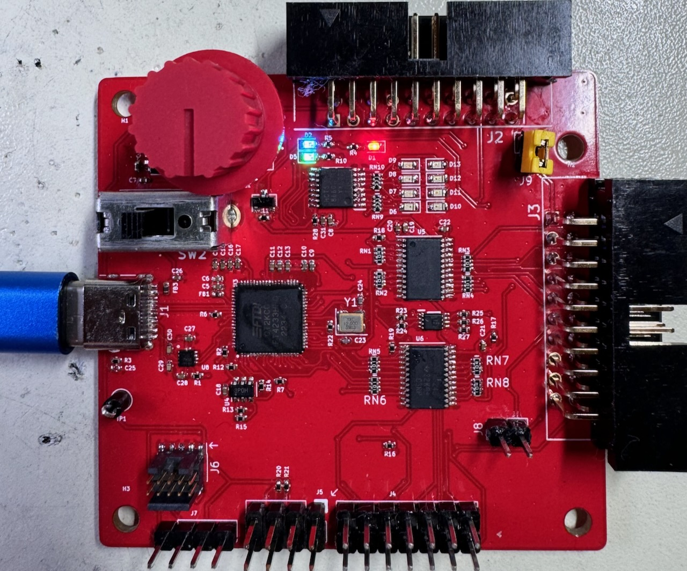
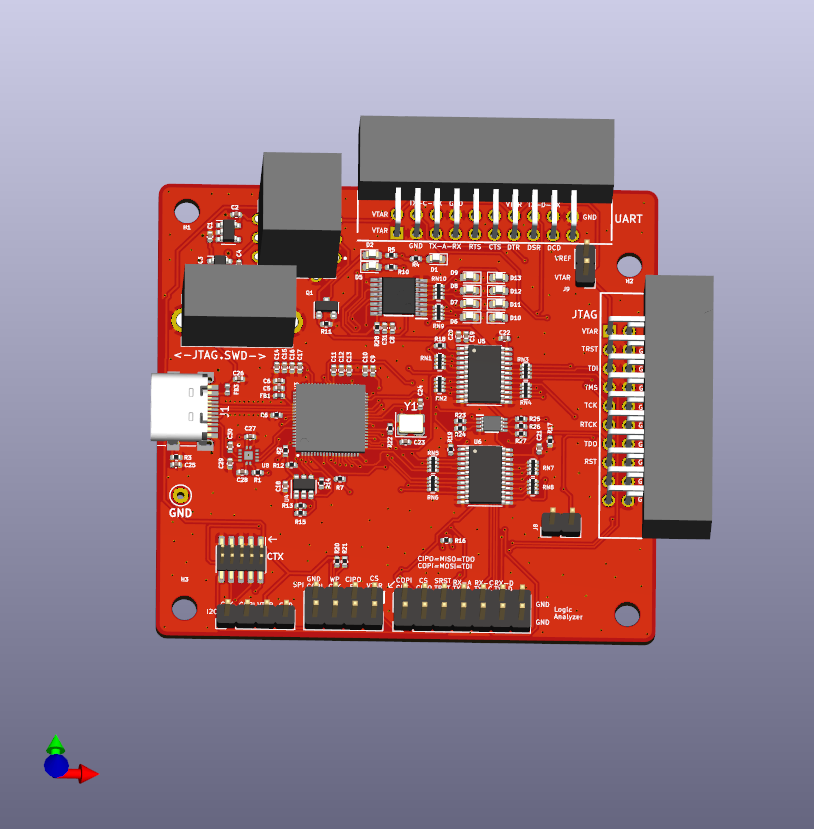

<h1 align="center">
  <br>
    <a>SERBERUS</a>
</h1>

<h4 align="center">Multi-headed and Multi-Protocol embedded system hacking tool.</h4>


<p align="center">
  
  <br>
</p>

# OVERVIEW
- The Serberus is a serial Man-in-the-Middle hardware hacking tool
- It has 4 channels, based on the FTDI 4233
- Has the ability to connect to JTAG, SPI, I2C and SWD interfaces
- Has a Level shifter and switch to allow you to connect to logic voltages of 1.8, 2.5 and 3.3v or any arbitrary voltage between 1.65v and 5.5v

# BOARD RENDERING 

<p align="center">
  
  <br>
</p>

# CONTENTS
- [System Requirements](#system-requirements)
- [What makes the Serberus unique](#what-makes-the-serberus-unique)
- [Basic Usage](#basic-usage)
  - [UARTS](#uarts)
  - [JTAG](#jtag)
  - [Other Connections](#swd-i2c-spi)
- [Switch 1](#switch-1)
- [Switch 2](#switch-2)
- [Jumpers](#jumpers-j8-and-j9)
  - [J8](#j8)
  - [J9](#j9)
- [UART]()
- [JTAG]()
- [SPI]()
- [I2C]()
- [Cortex](#cortex)
- [Logic Analyzer](#logic-analyzer)
- [Power Delivery](#power-delivery)
- [License](#license)


## System Requirements
No drivers should be required, the FTDI devices are supported by most operating systems.
The UART ports will work right away with screen, putty or your favorite serial console or serial access application such as OPENOCD.
## What makes the Serberus unique:
The Serberus is based on a couple of earlier FTDI USB to TTL tools, the TIMEP and the TIGARD. The items below are some of the major changes from those designs.
- 3 UART Ports
- J-Link Compatible JTAG connector - use any of those J-link to XXX connectors or breakouts
- Indicators for each of the 4 serial channels - help debugging
- 2.54 MM Logic Analyzer connector - Easily connect the most common logic analyzers or an MSO scope
## Basic Usage
When you plug in the Serberus, your system will be recognize the FTDI chip and the 4 serial ports. 
### UARTS
The first, third and forth serial ports are intended for UART. You can use your favorite serial access tool, (Putty, screen) to access them as you would any other USB to serial device
<br>
example<br>
`screen /dev/ttyUSB0 {baudrate}`

### JTAG
I need to do a little more work here as most of the tools like `pyftdi` and `flashrom` do not look for the FT4233. `pyftdi` should work with `--vidpid` flag and the value 0403:6041. You may need to change udev permissions 

### SWD, I2C, SPI
Details coming soon

## SWITCH 1
Switch 1 is the rotary target voltage select switch, it has 4 positions. The first position is intended to match the voltage of your target and should rarely be needed, however it is included for those one-off scenarios where your target has a strange voltage between 1v6 and 5v5 but will not work with the provided levels. It will also adapt if your target changes voltage during the power up process. (I encountered this only once in all my years of testing.) J9 must have a jumper on it to make this connection.

The remaining 3 positions match the likely voltages of 1v8, 3v3 and 5v. Ideally in your workflow you will test your target and know what voltage level is appropriate. This switch works by taking the output of the voltage regulators U1, U2 or the 5v VBUS voltage and sending it to the level shifters VREF pin, to match the logic level of these signals.

| Position | Function |
|----------|----------|
| 1        | VTARGET  |
| 2        | 1v8      | 
| 3        | 3v3      |
| 4        | 5v       |


## SWITCH 2
Switch 2 is for combining various inputs to allow the second serial port to be used for JTAG, SPI, SWD and I2C. Switch to the left is for JTAG and SPI, separating the necessary TX and RX pins while the right position combines them for SWD and I2C.

## Jumpers J8 and J9
### J8 
connect VREF to VTARGET, allowing you to take the voltage level of your target and use that as the voltage level of the level shifters. J8 must have a jumper in place and SW1 must be in the first position for this feature to function.
### J9
For iCE FPGA programming, I added this feature from the TIGARD as it was an easy feature to include for a minimal cost. Close the jumper to connect UARTA_RX and Misc_RX, make sure SW2 is in JTAG mode. 

## UART
The top connector has 3 UART connections, it is a standard 20 pin flat cable connector. The first UART has all 7 signal pins connected, for those rare instances where they are needed. The first UART is mapped to the first 4233 channel.
<br>
The second and third UARTS are mapped to the 3rd and 4th channels ports, as the second is used by the combined JTAG/SWD/I2C and SPI port. These ports only have TX and RX connected.

### UART Header Pinout

| Pin   | Function  |
|-------|-----------|
| 1     | VTARGET   |
| 2     | VTARGET   | 
| 3     | GND       |
| 4     | TX-C      |
| 5     | TX-A      |
| 6     | RX-C      |
| 7     | RX-A      |
| 8     | GND       |
| 9     | RTS-A     |
| 10    | NC        |
| 11    | CTS-A     |
| 12    | RX-D      |
| 13    | DTR-A     |
| 14    | VTARGET   |
| 15    | DSR-A     |
| 16    | TX-D      |
| 17    | DCD-A     |
| 18    | RX-D      |
| 19    | NC        |
| 20    | GND       |

## JTAG
The JTAG header is presented on J3, the right side of the board opposite the USB connector. The connector is a 20 Pin standard pitch Flat cable style.  It is intended to match the Segger J-LINK pinout as much as possible, making it easier to use the many J-Link connectors to make a direct connection to an accessible header on your target.

### JTAG Header Pinout

| Pin   | Function |
|-------|----------|
| 1     | VTARGET  |
| 2     | NC       |
| 3     | TRST     |
| 4     | GND      |
| 5     | TDI      |
| 6     | GND      |
| 7     | TMS      |
| 8     | GND      |
| 9     | TCK      |
| 10    | GND      |
| 11    | MISC_RX* |
| 12    | GND      | 
| 13    | TDO      | 
| 14    | GND      |
| 15    | SRST     |
| 16    | GND      |
| 17    | NC       |
| 18    | GND      |
| 19    | NC       |
| 20    | GND      |

*Connected to BDBUS 6 as an input on the FT4233, only needed for bizarre on-off connections, for most purposes, leave as NC.

## SPI
 SW2 in _leftmost_ position (1)
### SPI Pinout:
| Pin   | Function      |
|-------|---------------|
| 1     | CS            |
| 2     | VTARGET       |
| 3     | CIPO/MISO     |
| 4     | WP (PULLUP)   |
| 5     | EN (PULLUP)   |
| 6     | CLK           |
| 7     | GND           |
| 8     | COPI/MOSI     |

## I2C
 SW2 in _rightmost_ position (2)
### I2C Pinout:
| Pin   | Function |
|-------|----------|
| 1     | SCL      |
| 2     | SDA      |
| 3     | VTARGET  |
| 4     | GND      |

## CORTEX
A 10 pin cortex debug connector is present and will enable an easy connection to this common debug connector. 
### CORTEX Pinout
| Pin   | Function     |
|-------|--------------|
| 1     | VTARGET      |
| 2     | CORTEX PIN 2 |
| 3     | GND          |
| 4     | TCK          |
| 5     | GND          |
| 6     | TDO          |
| 7     | NC           |
| 8     | TDI          |
| 9     | GND          |
| 10    | SRST         |

## Logic Analyzer
The 14 pin header at the bottom next to the SPI and I2C connectors replicates most of the signal lines for easy connection to a logic analyzer or digital MSO lines of an oscilloscope. The pin header is standard 2.54mm pitch to easily connect using standard Dupont style jumper wires.
### Logic Analyzer Pinout

| Pin   | Function      |
|-------|---------------|
| 1     | CLK           |
| 2     | COPI/TDI      | 
| 3     | CIPO/TDO/SWDIO|
| 4     | TMS/CS        |
| 5     | TRST          |
| 6     | SRST          |
| 7     | TX-A          |
| 8     | RX-A          |
| 9     | TX-C          |
| 10    | RX-C          |
| 11    | TX-D          |
| 12    | RX-D          |
| 13    | GND           |
| 14    | GND           |


## POWER DELIVERY
The FT4233 is capable of power delivery (PD) and the design includes a DPO2036 for OVP. No other PD features have been added and the FTDI settings are at default. Power delivery is something that could be added but is well beyond the scope of this device for its initial release. Please feel free to experiment with forked designs.

## License
```Copyright 2024 Google LLC
Licensed under the Apache License, Version 2.0 (the "License");
you may not use this file except in compliance with the License.
You may obtain a copy of the License at

    https://www.apache.org/licenses/LICENSE-2.0

Unless required by applicable law or agreed to in writing, software
distributed under the License is distributed on an "AS IS" BASIS,
WITHOUT WARRANTIES OR CONDITIONS OF ANY KIND, either express or implied.
See the License for the specific language governing permissions and
limitations under the License.
```
